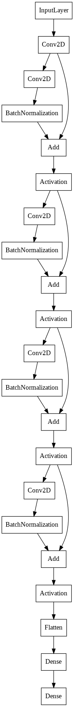

# ♟ Chess AI

Project created with MLOps-Template cookiecutter. For more info: https://mlop-guide.github.io/

## Showcase: [Play Chess on Google Colab](https://colab.research.google.com/drive/1xEmmstFm2_NWrnP9Hnk3Ys8SizNXFJFQ#scrollTo=YDPQwzIVffyb)

You can also run th notebook locally with this repository following this README
## 📋 Requirements

* DVC
* Python3, pip and jupyter
* GPU Access OR Google Colab
* Access to ChessAI Google Drive OR the following files:
    - data/dataset.7z
    - models/model-ResConv2d.h5

## 🏃🏻 Running Project

Running the playable Jupyter Notebook
```
jupyter notebook notebooks/PlayChess.ipynb
```

## Model

Residual Convolutional with 5 main Conv2D layers, using ReLU activation function.


Plot of the model:
<center>

</center>
